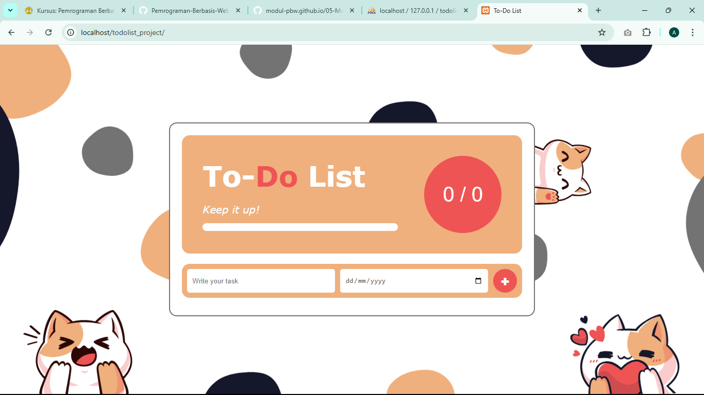
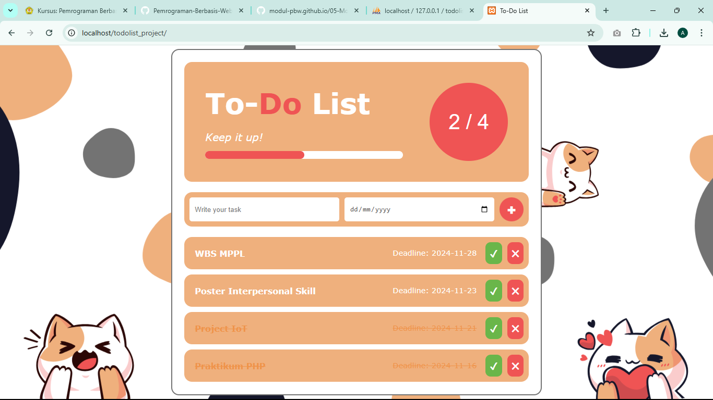
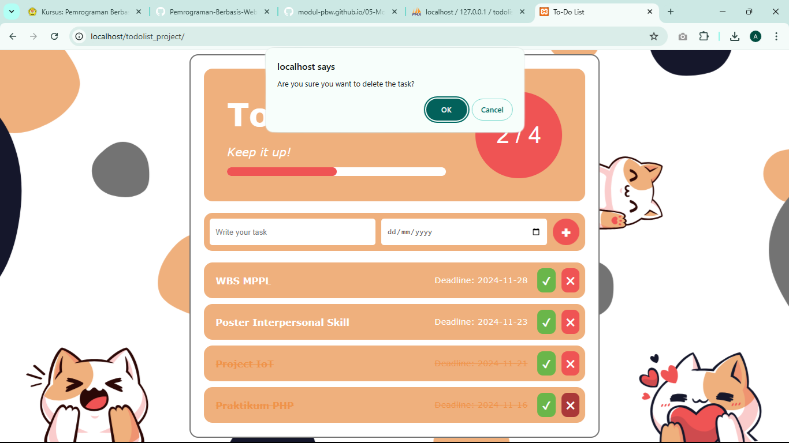
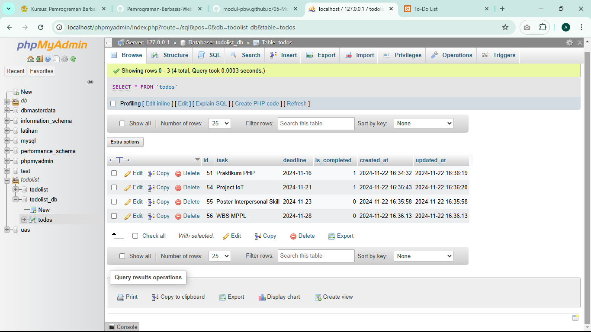

# To-Do List Project

## 📋 Overview
**To-Do List** ini dirancang untuk mempermudah pengelolaan tugas sehari-hari dengan menerapkan prinsip ***Object-Oriented Programming* (OOP)** dalam PHP serta menggunakan arsitektur ***Model-View-Controller* (MVC)**. Pendekatan ini memisahkan logika, tampilan antarmuka, dan pengelolaan data, sehingga kode menjadi lebih terstruktur, fleksibel, dan mudah untuk dikembangkan maupun dikelola.

**To-Do List** ini mendukung operasi **CRUD (*Create, Read, Update, Delete*)**, yang memungkinkan untuk mencatat tugas baru dengan menetapkan tanggal jatuh tempo, menandai tugas yang telah selesai, serta menghapus tugas yang tidak lagi relevan. Seluruh data tugas disimpan di dalam database, sehingga data tidak akan hilang dan dapat diakses kembali meskipun dimuat ulang atau digunakan di lain waktu.

## 🚀 Features
1. **Task Management**
   - **Tambah Tugas Baru:** Menambahkan tugas baru dengan nama tugas (*task*) dan tanggal jatuh tempo (*deadline*).
   - **Tandai Tugas Selesai:** Tugas dapat ditandai sebagai selesai, dengan tampilan visual berupa perubahan warna teks dan pemberian garis coretan (*strikethrough*).
   - **Hapus Tugas:** Tugas dapat dihapus dengan konfirmasi terlebih dahulu untuk mencegah penghapusan yang tidak disengaja.
2. **Statistics Dashboard**
   - Menampilkan berapa jumlah tugas total dan tugas selesai.
   - Indikator visual berupa progress bar.
3. **Dynamic Updates**
   - Statistik diperbarui secara otomatis menggunakan JavaScript.
4. **Responsive Design**
   - Tampilan antarmuka responsif untuk berbagai ukuran layar.

## 📂 File Structure
```graphql
/todolist_project
├── index.php                    # Entry point aplikasi
├── core
│   └── Database.php             # Koneksi database menggunakan PDO
├── models
│   ├── Todo.php                 # Model Todo yang merepresentasikan setiap task
│   └── TodoModel.php            # Model untuk operasi CRUD pada database
├── controllers
│   └── TodoController.php       # Controller untuk mengatur logika bisnis Todo
├── views
│   └── listTodos.php            # Template/view untuk menampilkan daftar Todo
└── assets
    ├── css
    │   └── style.css            # File CSS untuk styling
    └── js
        └── script.js            # File JavaScript untuk interaksi tambahan
```

## 🛠️ How It Works
1. Mengisi formulir untuk memasukkan nama tugas (*task*) dan tanggal jatuh tempo (*deadline*). Saat tombol `add` atau `ikon tambah (➕)` ditekan, data tugas dikirim ke server menggunakan metode `POST` dengan parameter `action=add`. Controller (`TodoController.php`) kemudian akan memproses data tersebut dan menyimpannya ke dalam tabel `todos` di database menggunakan fungsi yang ada di `TodoModel.php`.

2. Setelah data tersimpan, daftar tugas muncul di halaman. Data tugas diambil dari tabel `todos` di database menggunakan fungsi `getAllTodos()` dari `TodoModel.php`, kemudian ditampilkan secara iteratif menggunakan loop `foreach`. Setiap tugas memiliki dua tombol aksi: `complete` atau `ikon centang (✔️)` untuk menandai tugas selesai, dan `delete` atau `ikon silang (✖️)` untuk menghapus tugas.

3. Saat tombol `complete` atau `ikon centang (✔️)` ditekan, parameter `action=complete&id={id_tugas}` akan dikirim ke server. Controller (`TodoController.php`) kemudian akan memanggil fungsi di `TodoModel.php` untuk memperbarui status tugas (`is_completed`) di database menjadi selesai (`1`). Tugas yang selesai akan ditampilkan dengan diberi gaya garis coret (*strikethrough*) dan perubahan warna teks melalui kelas `completed`.

4. Saat tombol `delete` atau `ikon silang (✖️)` ditekan, modal konfirmasi akan muncul untuk mencegah penghapusan yang tidak disengaja. Jika dikonfirmasi, parameter `action=delete&id={id_tugas}` akan dikirim ke server. Controller (`TodoController.php`) kemudian akan memanggil fungsi di `TodoModel.php` untuk menghapus tugas dari database. Setelah tugas berhasil dihapus, tampilan daftar tugas akan diperbarui otomatis, dan tugas yang telah dihapus tidak lagi ditampilkan di halaman.

5. Statistik tugas akan dihitung berdasarkan jumlah total tugas menggunakan `const totalTasks = taskList.children.length;` dan jumlah tugas yang telah diselesaikan menggunakan `const completedTasks = document.querySelectorAll("#taskList .task.completed").length;`. Dengan data tersebut, persentase penyelesaian dapat dihitung menggunakan `const progressPercentage = totalTasks ? (completedTasks / totalTasks) * 100 : 0;`. Proses ini memastikan statistik tugas diperbarui secara dinamis setiap kali tugas ditambahkan, dihapus, atau ditandai selesai.

## 📸 Screenshots
### 1. Tampilan Awal To-Do List
Tampilan awal pada To-Do List di mana belum ada tugas yang ditambahkan, statistik tugas menunjukkan `0/0`, progress bar kosong, dan daftar tugas tidak menampilkan item apa pun.



### 2. Tampilan To-Do List dengan Tugas
Setiap tugas memiliki opsi untuk ditandai sebagai selesai (✔️) atau dihapus (✖️). Ketika sebuah tugas ditandai sebagai selesai, tugas tersebut secara otomatis diberi gaya garis coret (*strikethrough*) pada nama tugas (*task*) dan tanggal jatuh tempo (*deadline*), serta perubahan warna teks tugas untuk memberikan indikasi visual bahwa tugas tersebut telah selesai. Selain itu, statistik tugas akan diperbarui secara dinamis berdasarkan status tugas. Jumlah tugas yang telah selesai akan tercatat, dan persentase penyelesaian ditampilkan melalui indikator progress bar.



### 3. Tampilan Saat Penghapusan Tugas
Ketika mencoba menghapus sebuah tugas, dialog konfirmasi akan muncul untuk memastikan tindakan tersebut. Jika disetujui, maka tugas akan dihapus dari daftar dan database.



### 4. Tampilan Database
Data tugas yang dimasukkan akan disimpan dalam tabel database bernama `todos`. Tabel ini terdiri dari beberapa kolom dengan fungsi sebagai berikut:
- **`id`:** Kolom *primary key* yang berisi ID unik untuk setiap tugas. ID ini diatur secara otomatis menggunakan *auto-increment*.
- **`task`:** Kolom yang menyimpan nama tugas yang dimasukkan.
- **`deadline`:** Kolom yang menyimpan tanggal jatuh tempo untuk setiap tugas, dengan format `YYYY-MM-DD`.
- **`is_completed`:** Kolom yang menyimpan status tugas, di mana nilai `1` menunjukkan bahwa tugas telah selesai, sedangkan nilai `0` menunjukkan bahwa tugas belum selesai.
- **`created_at`:** Kolom *timestamp* yang menyimpan waktu kapan tugas dibuat.
- **`updated_at`:** Kolom *timestamp* yang menyimpan waktu kapan data tugas terakhir kali diperbarui.



---

Anisa Pebriyani Huslan | 220660121016 | IF-VE